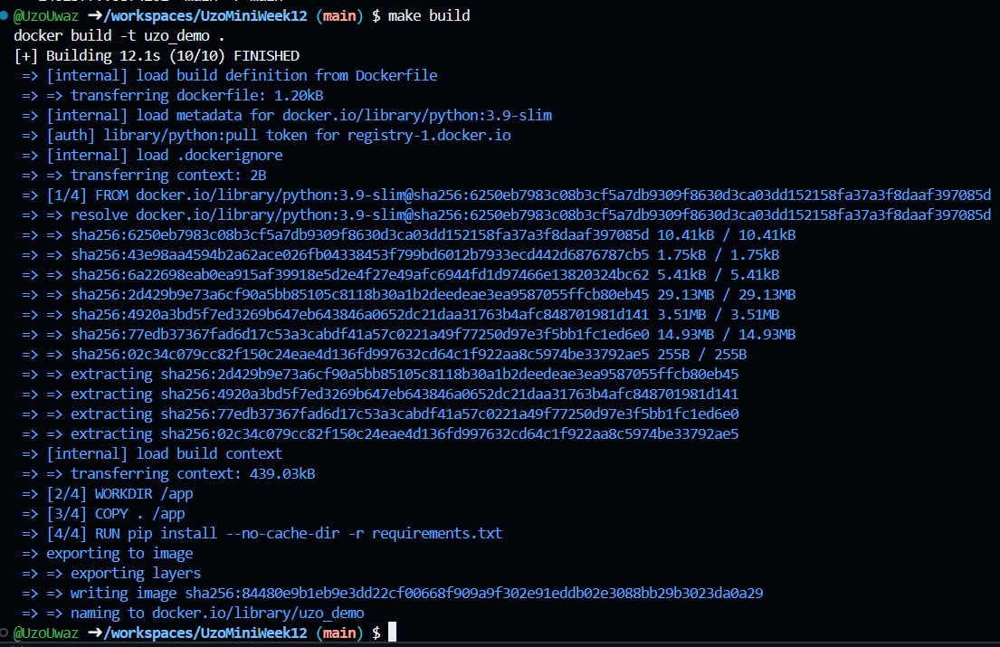

[](https://github.com/nogibjj/UzoMiniWeek12/actions/workflows/build.yml)

---

# 🐍 Random Number Generator with Flask & Docker 🚀

## 🌟 Project Overview
This is a **Random Number Generator** application built using **Flask**, a lightweight Python web framework. It allows users to generate random numbers through a simple web interface. This project also includes **Docker**, making it easy to containerize and run the application in any environment. Perfect for learning Flask and Docker fundamentals!

---

## 🔧 Features
- 🖥️ **Landing Page**: A web interface to input a range of numbers and generate random results.
- 🎲 **Random Number Generation**: Users can specify a `min` and `max` range for custom random numbers.
- 📦 **Dockerized**: The app is containerized for portability and ease of deployment.

---

## 📂 Directory Structure
Here's a simplified data structure of the project:

```
📁 Project Directory
├── app.py           # Main Flask application
├── Dockerfile       # Docker configuration for containerizing the app
├── requirements.txt # Python dependencies
├── README.md        # Project documentation
├── Makefile         # Optional command automation
├── .github/         # GitHub Actions workflows (if used)
├── .env             # Environment variables (for secrets/configs)
├── __pycache__/     # Python cache (auto-generated)
├── readme_images/   # Images for documentation
└── .gitignore       # Ignored files for Git
```

---

## 🚀 Why Use Flask?
Flask is a lightweight and flexible Python framework for building web applications. Here's why it's great:
- 🛠️ **Simplicity**: Flask is easy to learn and perfect for small to medium-sized projects.
- 🔌 **Extensibility**: You can add features using Flask extensions.
- 📦 **Minimalism**: It's a micro-framework, so you can keep your project lightweight and fast.

---

## 🐳 Why Use Docker?
Docker is a containerization tool that allows you to package your app and its dependencies together. Its real-world benefits:
- 🌎 **Portability**: Your app runs the same way on any machine, whether it's your laptop or a cloud server.
- 🛡️ **Isolation**: Docker containers keep your app and dependencies separate from the host system.
- 🚀 **Efficiency**: Docker allows rapid setup and deployment of applications.

---

## 🛠️ How to Run the Application
1. **Clone the Repository**:
   ```bash
   git clone <repo-url>
   cd <project-directory>
   ```

2. **Run Locally**:
   Install dependencies and start the app:
   ```bash
   pip install -r requirements.txt
   python app.py
   ```

3. **Run with Docker**:
   Build and run the container:
   ```bash
   docker build -t flask-random-generator .
   docker run -p 5000:5000 flask-random-generator
   ```

4. Open in your browser:
   ```
   http://127.0.0.1:5000/
   ```

---

## 🌐 Example Output
When you visit the application, you’ll see a simple form. After entering your range, you’ll receive a random number!

---

## 📝 Additional Notes
- **Flask**: Perfect for prototyping and small web applications.
- **Docker**: Ensures your app is environment-independent and production-ready.

---

The image has been created and stored on Docker see the confirmation below. 

